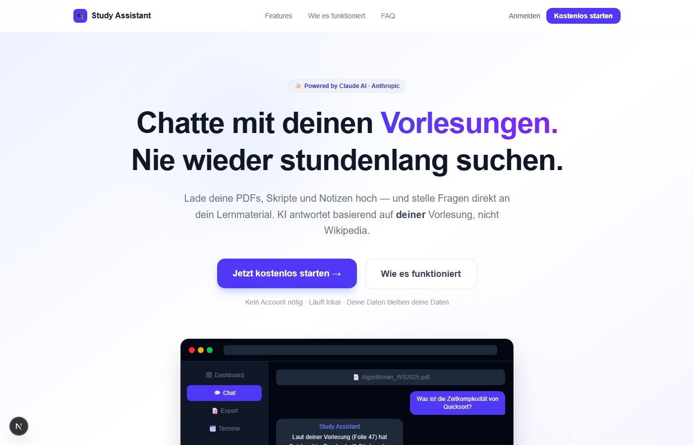
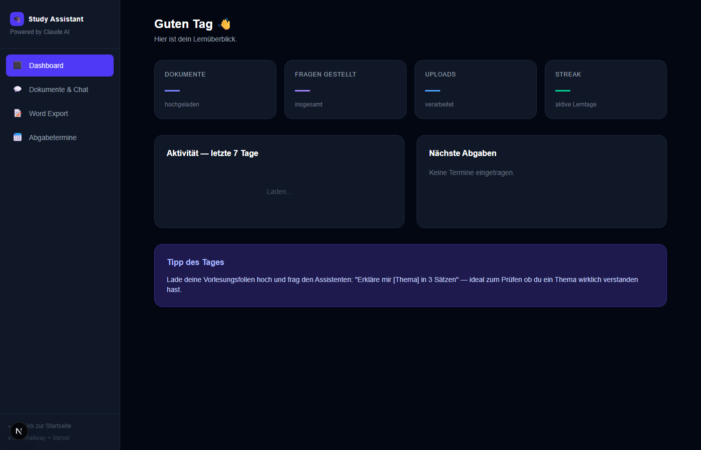
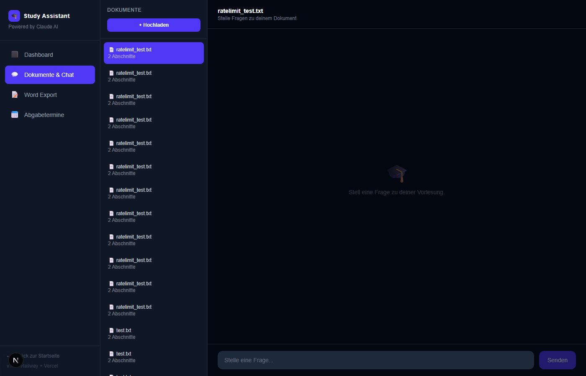
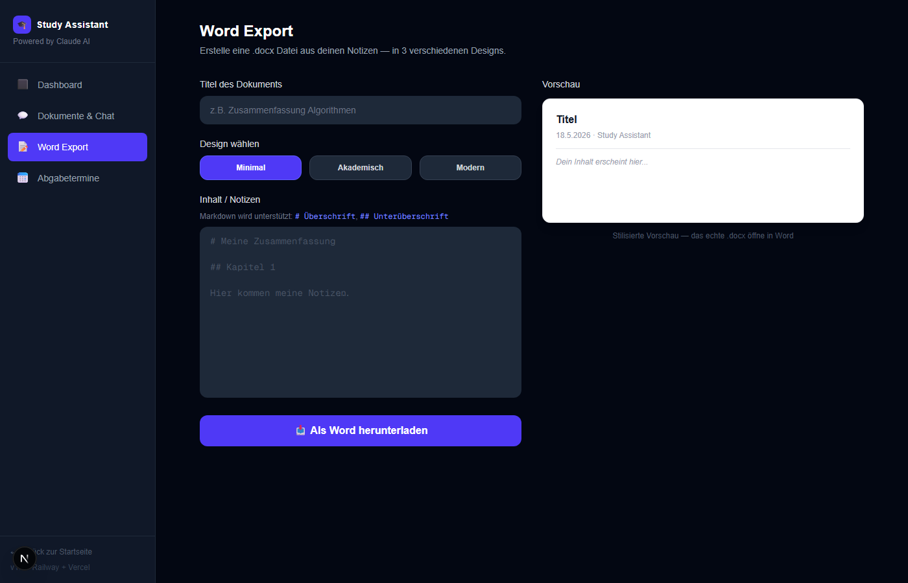
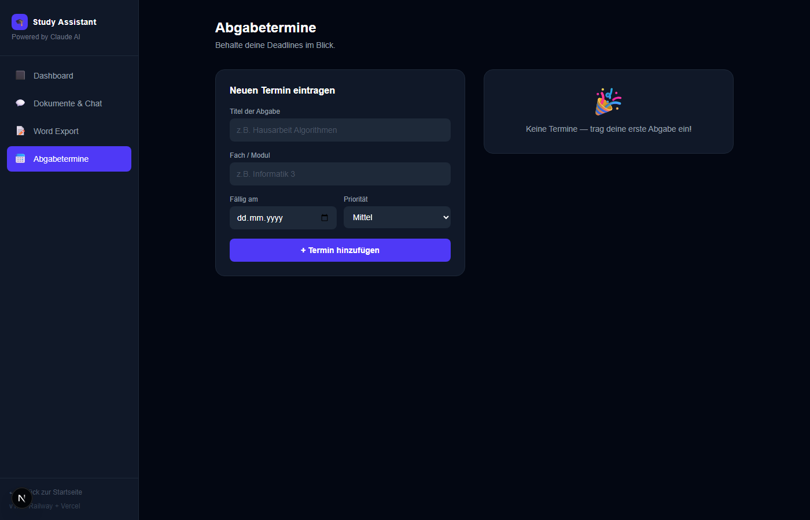
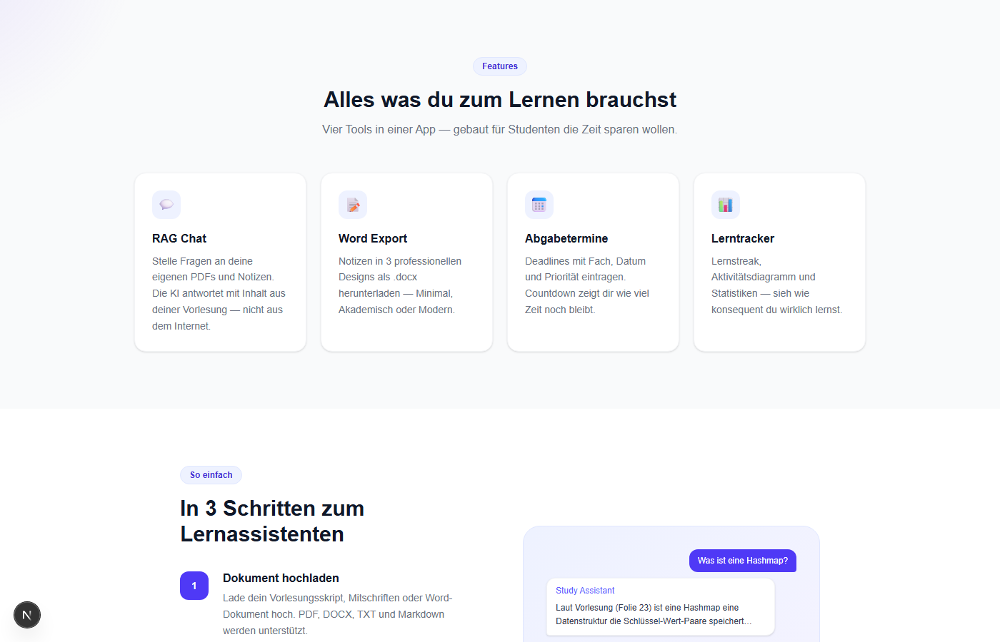

<div align="center">

# 🎓 Study Assistant

**AI-gestützter Lernbegleiter — chatte mit deinen Vorlesungen, tracke Deadlines, exportiere Notizen als Word.**

[](https://nextjs.org)
[](https://fastapi.tiangolo.com)
[](https://anthropic.com)
[](https://python.org)
[](LICENSE)

[**Live Demo**](https://giorgiodettmar.com) · [**Portfolio**](https://giorgiodettmar.com) · [**Autor**](#autor)

</div>

---

## Das Problem

Ich mache eine IHK-Ausbildung zum Fachinformatiker und studiere parallel B.Sc. Computer Science im Fernstudium an der University of the People — und kenne dieses Problem täglich:

- **200-seitige Skripte** — und kein Plan welche Seite die Antwort hat
- **Abgabetermine** die in 4 verschiedenen Apps, Zetteln und dem Kopf liegen
- **Mitschriften** als unleserliche Textwand ohne Struktur
- **Keine Übersicht** ob man überhaupt genug lernt

Besonders im Fernstudium ohne feste Präsenzzeiten ist Selbstorganisation alles. Diese App löst das mit **RAG (Retrieval Augmented Generation)** — Claude AI antwortet basierend auf **deinem spezifischen Material**, nicht allgemeinem Internet-Wissen.

---

## Screenshots

### Landing Page


### Dashboard & Lerntracker


### RAG Chat mit Dokumenten


### Word Export (3 Designs + Live-Vorschau)


### Abgabetermine & Deadlines


### Features Übersicht


---

## Features

| Feature | Beschreibung |
|---|---|
| 💬 **RAG Chat** | Stelle Fragen direkt an deine PDFs, Word-Dokumente und Notizen — Claude antwortet mit Inhalt aus deiner Vorlesung |
| 📝 **Word Export** | Notizen in 3 professionellen Designs (Minimal, Akademisch, Modern) als `.docx` herunterladen mit Live-Vorschau |
| 📅 **Abgabetermine** | Deadlines mit Fach, Priorität & Datum eintragen — Countdown zeigt wie viel Zeit noch bleibt |
| 📊 **Lerntracker** | Lernstreak, 7-Tage Aktivitätsdiagramm, Fragen- und Upload-Statistiken |
| 🔒 **Rate Limiting** | IP-basierter Schutz vor API-Missbrauch (10 Uploads/h, 30 Chats/h) |
| 📁 **Multi-Format** | PDF, DOCX, TXT und Markdown werden alle verarbeitet |
| ✨ **Animationen** | Framer Motion Scroll-Animationen + Cursor-Glow Effekt auf der Landing Page |

---

## Wie RAG funktioniert

```
PDF hochladen
  → Text in ~800-Zeichen Abschnitte (Chunks) zerlegen
  → Jeden Chunk in Zahlenvektor umwandeln (Embedding via sentence-transformers)
  → Vektoren in ChromaDB speichern

Frage stellen: "Was ist Polymorphismus?"
  → Frage ebenfalls in Vektor umwandeln
  → Die 4 ähnlichsten Chunks aus der DB finden (cosine similarity)
  → Claude bekommt: Kontext aus deiner Vorlesung + Frage
  → Antwort basiert auf DEINEM Material — nicht Wikipedia
```

---

## Tech Stack

### Backend
| Tool | Version | Zweck |
|---|---|---|
| **Python + FastAPI** | 3.11 / 0.115 | REST API |
| **Claude claude-sonnet-4-6** | Anthropic API | LLM für Chat-Antworten |
| **ChromaDB** | 0.5 | Lokale persistente Vektordatenbank |
| **sentence-transformers** | 3.3 | Kostenlose lokale Embeddings (`all-MiniLM-L6-v2`) |
| **pypdf + python-docx** | 5.1 / 1.1 | PDF & Word Parsing |
| **slowapi** | 0.1.9 | Rate Limiting (IP-basiert) |

### Frontend
| Tool | Version | Zweck |
|---|---|---|
| **Next.js** | 15 | React Framework (App Router) |
| **TypeScript** | 5 | Typsicherheit |
| **Tailwind CSS** | 3 | Styling |
| **Framer Motion** | 11 | Animationen & Cursor-Glow |

---

## Deployment

| Service | Für | Konfiguration |
|---|---|---|
| **Vercel** | Frontend (Next.js) | Automatisch aus GitHub. Root Dir: `frontend`. Env: `NEXT_PUBLIC_API_URL` |
| **Railway** | Backend (FastAPI) | Root Dir: `backend`. Env: `ANTHROPIC_API_KEY` |

### Vercel Setup
```bash
# In Vercel Dashboard → Environment Variables:
NEXT_PUBLIC_API_URL=https://deine-railway-url.railway.app
```

### Railway Setup
```bash
# In Railway → Variables:
ANTHROPIC_API_KEY=sk-ant-...

# Startbefehl:
uvicorn main:app --host 0.0.0.0 --port $PORT
```

---

## Lokales Setup

### 1. Backend

```bash
cd backend
python -m venv venv
venv\Scripts\activate        # Windows
# source venv/bin/activate   # Mac/Linux

pip install -r requirements.txt
cp .env.example .env         # ANTHROPIC_API_KEY eintragen

uvicorn main:app --reload --port 8001
# → http://localhost:8001
```

### 2. Frontend

```bash
cd frontend
npm install
npm run dev
# → http://localhost:3000
```

---

## API Endpunkte

| Method | Endpoint | Beschreibung | Rate Limit |
|---|---|---|---|
| `POST` | `/upload` | Dokument hochladen & verarbeiten | 10/h |
| `POST` | `/chat` | Frage an Dokument stellen (Claude AI) | 30/h |
| `GET` | `/documents` | Alle Dokumente auflisten | 60/h |
| `DELETE` | `/documents/{id}` | Dokument löschen | 20/h |
| `GET` | `/export/templates` | Verfügbare Word-Designs | — |
| `POST` | `/export/docx` | Notizen als `.docx` exportieren | 20/h |
| `POST` | `/deadlines` | Abgabetermin eintragen | 30/h |
| `GET` | `/deadlines` | Alle Termine mit Countdown | 60/h |
| `DELETE` | `/deadlines/{id}` | Termin löschen | 20/h |
| `GET` | `/progress` | Lernstatistiken (Streak, Aktivität) | 60/h |

---

## Projektstruktur

```
study-assistant/
├── backend/
│   ├── main.py          # FastAPI App + alle Routen
│   ├── rag.py           # RAG Pipeline (Embeddings, ChromaDB, Claude)
│   ├── export.py        # Word Dokument Templates (3 Designs)
│   ├── deadlines.py     # Deadline CRUD (JSON-basiert)
│   ├── progress.py      # Lernstatistiken & Streak-Tracking
│   └── requirements.txt
├── frontend/
│   ├── app/
│   │   ├── page.tsx     # Landing Page (Framer Motion)
│   │   └── app/
│   │       └── page.tsx # Dashboard (eingeloggter Bereich)
│   ├── components/
│   │   ├── Sidebar.tsx
│   │   ├── DashboardView.tsx
│   │   ├── ChatView.tsx
│   │   ├── ExportView.tsx
│   │   ├── DeadlinesView.tsx
│   │   └── CursorGlow.tsx
│   └── lib/api.ts       # API Client
└── screenshots/
```

---

## Autor

**Giorgio Dettmar** — Junior Full-Stack Developer aus Deutschland

> IHK Ausbildung Fachinformatiker Anwendungsentwicklung (bis 2027)  
> B.Sc. Computer Science — Fernstudium, University of the People  
> Fokus: AI-Integration, FastAPI, Next.js, TypeScript

[](https://giorgiodettmar.com)
[](https://github.com/Giorgiod91)
